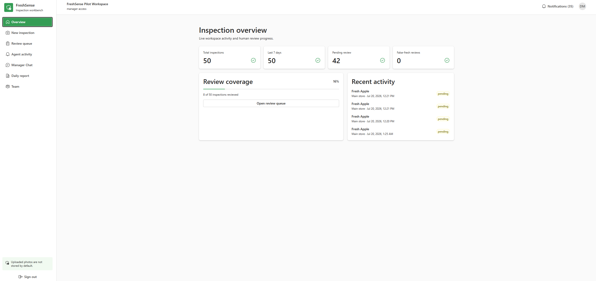
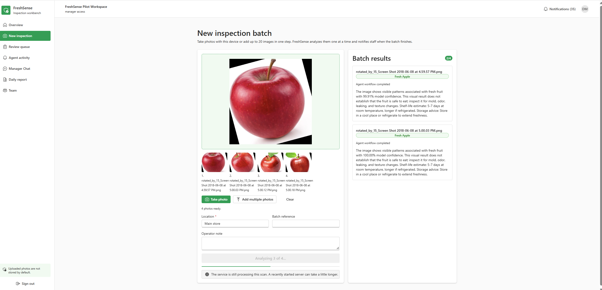
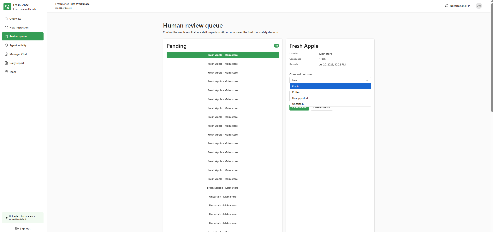
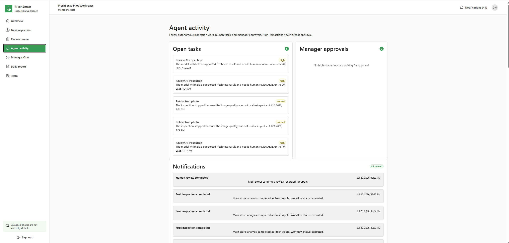
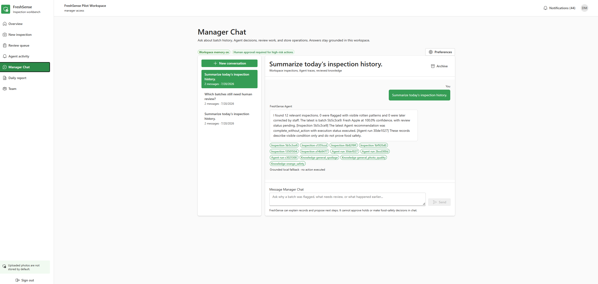
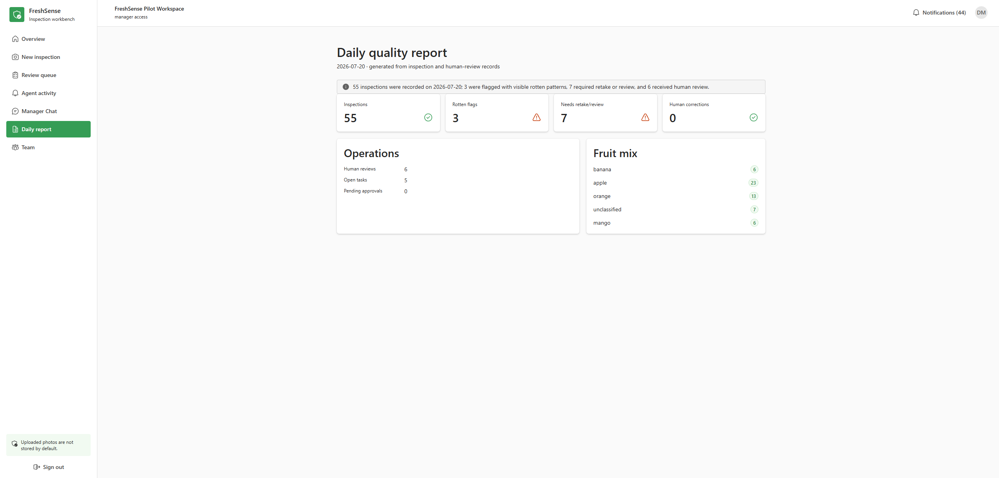
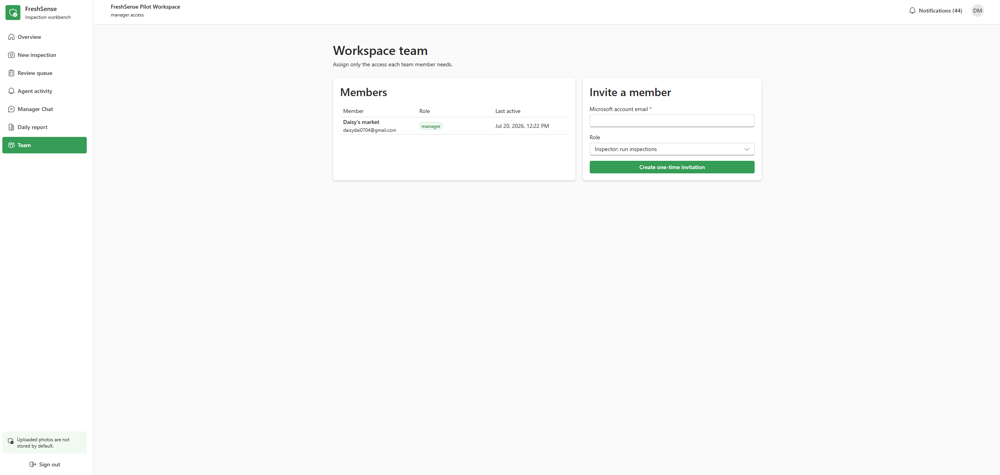
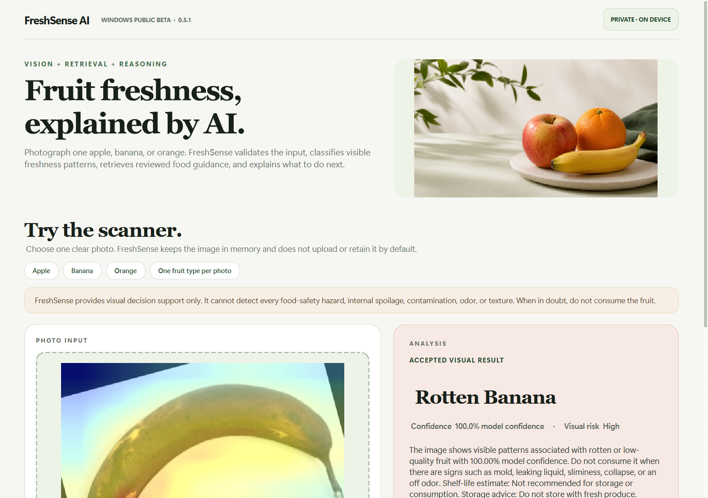
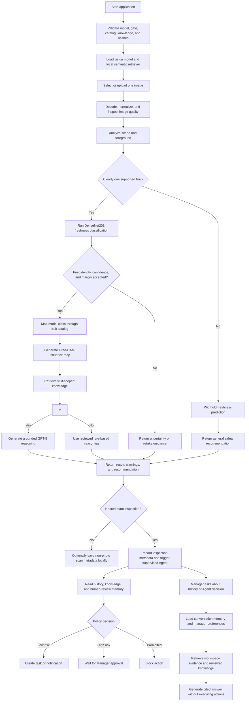

# FreshSense AI

FreshSense is a fruit inspection workbench for small grocery stores and produce
teams. Staff can photograph an incoming delivery or shelf batch, review the
visible-condition result, and keep the inspection record with the people who
need to act on it. The current model supports apples, bananas, oranges, mangoes,
tomatoes, and pears.

[Product overview](#product-overview) | [How to use FreshSense](#how-to-use-freshsense) | [Technology and AI](#technology-and-ai)

[Open the hosted beta](https://freshsenseai.com/) | [Download the Windows beta](https://github.com/yyq8548/FreshSenseAI--app/releases/download/v0.6.0/FreshSenseAI-Setup-0.6.0.exe)




## Product overview

Fruit checks in a small store are usually quick and informal. Someone looks at
a delivery, decides what needs attention, and moves on. That works until a later
shift needs to know what was checked, why a batch was flagged, or whether anyone
confirmed the result.

FreshSense gives that routine a shared workspace. An employee can use the device
camera or add up to 20 photos at once, record the store location and batch
reference, then continue with other work. The service processes each image,
records the result, runs a bounded workflow Agent, and notifies the team when the
batch is finished. Uploaded photos are not saved by default.

Reviewers can confirm, correct, or dismiss each result. Managers can follow open
tasks, inspect Agent decisions,
approve higher-risk actions, ask questions about inspection history, and read a
daily quality report. Workspace roles keep inspection, review, and management
permissions separate.

FreshSense is visual decision support. It does not certify that food is safe and
cannot detect internal spoilage, pathogens, contamination, odor, texture, or
chemical hazards. A person still inspects the fruit and makes the store's final
decision.

### Product tour

<table>
  <tr>
    <td width="50%"><br><sub>Camera and multi-photo batch inspection</sub></td>
    <td width="50%"><br><sub>Human review and correction queue</sub></td>
  </tr>
  <tr>
    <td width="50%"><br><sub>Agent activity, tasks, approvals, and notifications</sub></td>
    <td width="50%"><br><sub>Grounded Manager Chat with workspace citations</sub></td>
  </tr>
  <tr>
    <td width="50%"><br><sub>Daily inspection and review report</sub></td>
    <td width="50%"><br><sub>Role-based team access and one-time invitations</sub></td>
  </tr>
</table>

## How to use FreshSense

1. Open [freshsenseai.com](https://freshsenseai.com/) and sign in on the
   Microsoft-hosted identity page.
2. Select **New inspection**.
3. Choose **Take photo** or **Add multiple photos**. A batch can contain up to
   20 images. Each image should show one supported fruit type clearly.
4. Enter the store location. Add a batch reference or note if the team uses one.
5. Start the analysis. FreshSense resizes large phone photos in the browser and
   processes them one at a time. You can follow the progress in the batch panel.
6. Wait for the completion notification, then review any unsupported, uncertain,
   retake, fresh, or rotten result against the physical fruit.
7. Open **Review queue** to confirm or correct the model result. The correction
   becomes part of the workspace's reviewed history.
8. Use **Agent activity**, **Manager Chat**, and **Daily report** to follow work
   across the store. Managers can invite inspectors or reviewers from **Team**.

FreshSense stores the result, location, batch reference, note, review status,
and timestamps. It does not write uploaded image bytes or filenames to the
workspace database.

[Watch the 30-second Windows beta walkthrough](docs/demo/freshsense-public-beta-demo.mp4)

## Technology and AI

The hosted beta is a React and TypeScript client on Azure Static Web Apps. A
versioned FastAPI service runs on Azure App Service, PostgreSQL stores workspace
records, and Microsoft Entra External ID handles sign-in. The API checks the
token tenant, audience, scope, workspace, and role before returning customer
data.

The vision model is an ImageNet-pretrained TensorFlow DenseNet201 classifier
with 12 output classes: fresh and rotten apples, bananas, oranges, mangoes,
tomatoes, and pears. Before FreshSense displays a freshness label, a separate
supported-input gate checks whether the image resembles one supported fruit.
Image-quality checks and calibrated confidence rules can withhold the label and
ask for a better photo or human review. Grad-CAM is available as an optional
influence view for accepted predictions.

The workflow Agent is autonomous within narrow boundaries. After an inspection,
it can read same-batch and store history, retrieve reviewed fruit guidance,
create retake or review tasks, send in-product notifications, and prepare the
daily report. Higher-risk actions require manager approval. Every run records
its tool calls, policy decision, and outcome for later review.

Manager Chat adds persistent conversations and manager preferences. It answers
questions using workspace inspections, Agent traces, tasks, approvals, and
reviewed knowledge, with citations shown beside the answer. Chat cannot approve
a hold, discard inventory, or declare food safe. When an OpenAI model is
configured, it can write a grounded response from the retrieved evidence. The
deterministic local responder remains available when the provider is disabled
or unavailable.

Semantic retrieval uses FastEmbed with `BAAI/bge-small-en-v1.5` over the curated
knowledge base. The collection is currently small enough for in-memory ranking,
so FreshSense does not claim to have a persistent vector database. Routine
inspections also avoid remote LLM calls and optional Grad-CAM work to keep the
response path short. The uploaded photo is never sent to the language model.

One signed-in warm-service development test completed browser compression,
upload, authentication, inference, and metadata storage in about 2.36 seconds.
This is a development measurement, not a production latency guarantee. Model
confidence applies only to the 12 configured classes; the model card documents
the test data, gating results, and remaining real-world validation gaps.



## Windows desktop beta

The 0.6.0 installer includes the six-fruit model, supported-input gate, local
knowledge, and cryptographic artifact manifest described in the model card.

1. Download `FreshSenseAI-Setup-0.6.0.exe` from the latest GitHub Release and
   compare its SHA-256 with the published checksum.
2. Install and choose one clear photo containing an apple, banana, orange,
   mango, tomato, or pear.
3. Select **Analyze freshness**, then review the result, risk guidance, storage
   advice, safety warning, and optional model-influence view.

No Python, virtual environment, Docker, model download, or API setup is required
for the packaged Windows beta.

> **Safety notice:** FreshSense evaluates visible image patterns only. It cannot
> determine whether food is safe to eat or detect internal spoilage,
> contamination, odor, texture, pathogens, or chemical hazards. When in doubt,
> do not consume the fruit.

## Supported input

- One clear apple, banana, orange, mango, tomato, or pear type per image.
- JPEG, PNG, or WebP for the Streamlit interface; JPEG or PNG for desktop.
- Close framing, useful lighting, and limited occlusion.

Mixed fruit, other produce, packaged food, people, drawings, empty scenes, and
severely degraded photos are outside the intended input contract. FreshSense
can return unsupported, uncertain, or retake guidance instead of exposing a
tentative freshness label.

## Privacy by default

- Desktop and Streamlit analysis do not create an application copy of a photo.
- Photos are not automatically uploaded to GitHub or a FreshSense server.
- Local scan history contains metadata only and can be exported or cleared.
- Optional GPT-5 reasoning sends prediction and retrieved text, not the photo.
- The feedback action opens a prefilled GitHub issue without attaching the
  analyzed photo. Testers decide whether to add a de-identified image.

## Current evidence limits

The model's 12-class confidence is not general certainty. The expanded grouped
development test reached 98.54% accuracy before withholding and 99.16%
selective accuracy at 88.67% coverage, with 19 rotten-to-fresh errors among
2,158 rotten test images after gating. These results are not independent store
accuracy and synthetic unsupported testing does not replace real unsupported
photos. Earlier informal testing reportedly involved more than 50 users and
three orange errors, but case-level post-change retesting is not complete. See
the [model card](docs/MODEL_CARD.md) and
[public-beta pilot plan](docs/PUBLIC_BETA_PILOT.md).

## What FreshSense does

FreshSense accepts a photo containing one supported fruit type and returns:

- a fresh or rotten classification for apple, banana, orange, mango, tomato,
  or pear;
- model confidence when the result passes the safety gates;
- an optional Grad-CAM influence overlay for accepted predictions;
- image-quality and scene warnings;
- retrieved storage, shelf-life, spoilage, and food-safety knowledge;
- an explanation, risk level, storage advice, and recommendation; and
- an explicit unsupported or uncertain result when the supported-fruit gate,
  fruit-identity agreement, confidence, or class margin is insufficient.

The trained Keras model is the source of the visual prediction. FreshSense does
not generate a placeholder or random prediction if that model is missing or
invalid. Startup validation fails closed instead.

The application is available through four interfaces:

| Interface | Intended use | Entry point |
| --- | --- | --- |
| Windows desktop | Normal end-user scanning with local history | `desktop_app.py` |
| Streamlit web UI | Local development and demonstrations | `app.py` |
| Versioned REST API | Automation and future client integrations | `api.main:app` |
| Authenticated team workbench | Local SaaS workflow validation with Entra External ID | `web/` |

The desktop application runs without Docker and does not require the REST API.
A packaged Windows installer can include Python, the vision model, the knowledge
base, and local embedding assets so end users do not need a development
environment.

## Design flow

FreshSense loads and validates its shared assets once at startup. Each image then
moves through the same agent pipeline regardless of whether it came from the
desktop UI, Streamlit, or the REST API.



### Key design decisions

- **One shared agent:** all interfaces reuse the same vision, retrieval,
  reasoning, and recommendation components.
- **Configuration-driven labels:** `data/fruit_catalog.json` defines the exact
  model output order and fruit metadata.
- **Fail-closed startup:** the app refuses to start with an invalid model,
  calibrated gate, catalog, knowledge base, or model/gate hash mismatch.
- **Dedicated supported-input gate:** DenseNet feature prototypes first decide
  whether an image clearly resembles one supported fruit identity; freshness
  classification is exposed only after that decision passes.
- **Uncertainty gating:** low confidence or a small top-two class margin produces
  an uncertain result without fruit-specific advice.
- **Grounded reasoning:** retrieved knowledge is supplied to GPT-5 when enabled;
  a deterministic reviewed rules engine remains available as fallback.
- **Local-first retrieval:** embeddings and ranking run on-device. A keyword
  retriever is used with a visible warning if semantic embeddings are
  unavailable.
- **Bounded explainability:** Grad-CAM is generated only for accepted model
  classes and is presented as influence, never proof of spoilage.
- **Low-latency inspection path:** the hosted API skips Grad-CAM and remote LLM
  calls during routine scans, warms the model once in the background, and keeps
  the Azure worker active. Detailed explainability remains an explicit opt-in.
- **No required cloud backend:** only optional GPT-5 reasoning sends a text
  payload to the OpenAI API. The image itself is not sent to OpenAI by this
  application.

### Response-time design

Routine SaaS inspections use a dedicated fast path: phone photos are resized to
a maximum 1024px edge in the browser, inference uses deterministic local
reasoning, and Grad-CAM is omitted unless requested. On the development Windows
machine, repeated warm-model inference measured approximately 0.12-0.14 seconds
(network and browser upload excluded), compared with about 1.05 seconds before
removing per-request Grad-CAM. Azure startup now exposes health immediately while
the model and workspace store initialize in the background; routine analysis is
enabled only after the model reports ready.

## Implemented features

| Feature | Status | Current behavior |
| --- | --- | --- |
| DenseNet201 computer vision | Implemented | Classifies 12 fresh/rotten labels for apple, banana, orange, mango, tomato, and pear |
| Image-quality checks | Implemented | Detects dark, overexposed, and blurry images |
| Scene analysis | Implemented | Flags empty-looking scenes, small foregrounds, and photos needing a closer crop |
| Confidence safety gates | Implemented | Requires minimum confidence and class-margin thresholds |
| Supported-input/open-set gate | Implemented baseline | Uses calibrated feature prototypes, model hashes, and fruit agreement before freshness output |
| Grad-CAM explainability | Implemented | Shows an in-memory influence overlay for accepted desktop results; API overlay bytes are opt-in |
| Unsupported/uncertain result | Implemented | Withholds the tentative class and fruit-specific guidance |
| Configuration-driven fruit catalog | Implemented | Validates class order, fruit metadata, and knowledge coverage at startup |
| Local RAG | Implemented | Retrieves curated food knowledge without an external service |
| Embedding-based semantic RAG | Implemented | Uses FastEmbed with `BAAI/bge-small-en-v1.5` and in-memory cosine ranking |
| Keyword retrieval fallback | Implemented | Preserves deterministic retrieval when embeddings cannot load |
| GPT-5 reasoning | Implemented, optional | Uses retrieved evidence when an API key is configured |
| Rule-based reasoning | Implemented | Provides reviewed offline guidance and GPT failure fallback |
| Windows desktop UI | Implemented | Photo selection, analysis, results, warnings, and history controls |
| Streamlit UI | Implemented | Responsive scanner, bundled samples, evidence hierarchy, safety states, and progressive technical disclosure |
| Local scan history | Implemented | Stores up to 200 metadata-only records and supports CSV export and clearing |
| REST API | Implemented | Health, analysis, metrics, OpenAPI documentation, validation, and structured errors |
| API hardening | Implemented | Optional API key, rate limiting, trusted hosts, CORS controls, security headers, request IDs, and JSON logs |
| SaaS inspection foundation | Implemented | Workspace-scoped analysis metadata, locations, human review audit, dashboard aggregates, and SQLite/PostgreSQL persistence |
| Customer identity | Implemented in hosted beta | Validates Entra External ID access tokens through OIDC discovery, audience, tenant, scope, and optional caller checks |
| Workspace roles and invitations | Implemented in hosted beta | One-time email-bound invites plus manager, inspector, and reviewer API authorization |
| Responsive team workbench | Implemented in hosted beta | Fluent UI React client for inspection, review, team, and real workspace metrics |
| Windows installer pipeline | Implemented | Builds versioned installer, checksum, manifest, and install/uninstall smoke tests |
| Automated tests | Implemented | Pytest suite runs locally and through GitHub Actions |
| Reproducible ML evaluation | Implemented | Versioned grouped manifests, safety metrics, plots, calibration, subgroup and latency reports |
| Real-model Windows CI | Implemented | Immutable checksum bundle, golden predictions, OOD regression, semantic RAG, secure API, installer build/launch |
| Controlled pilot tooling | Implemented | SQLite-backed metadata-only outcome, usability, comprehension, timing, and CSV reporting |
| MLflow model experiments | Implemented | Tracks grouped MobileNetV2 parameters, metrics, latency, reports, and model artifacts in local SQLite |
| Stakeholder and handoff package | Implemented | Defines workflow, value hypothesis, success criteria, risks, ownership, and production gaps |
| Fictional insurance RAG companion | Implemented example | Citation-first semantic retrieval, abstention, typed API, human oversight, and evaluation over authored fictional data |
| Azure readiness gate | Implemented, blocked by evidence | Fails closed until independent evaluation, pilot, tests, security review, and owner approvals exist |
| Azure-native staging foundation | Deployed beta | App Service API, immutable model-bundle verification, PostgreSQL metadata, Static Web Apps, External ID, and `freshsenseai.com` without Docker |
| Supervised workflow Agent | Implemented foundation | Uses typed tools, same-batch/store/fruit history, reviewed knowledge and memory, role tasks, notifications, manager approvals, and complete run/step auditing |
| Camera and multi-photo batches | Implemented | Opens the device camera or accepts up to 20 photos, compresses each locally, reports progress, and notifies the employee when processing finishes |
| Daily quality report | Implemented | Summarizes inspections, rotten flags, withheld results, human reviews, corrections, open tasks, approvals, and fruit mix |
| Manager Chat | Implemented | Manager-only multi-turn chat over workspace inspection history, Agent traces, tasks, approvals, and reviewed RAG evidence |
| Conversation memory and preferences | Implemented | Persists workspace-scoped text conversations plus per-manager language, detail, location, review-focus, and instruction preferences |

### Not implemented yet

- persistent vector database;
- hosted customer sign-up flow, billing, and account administration;
- production SLOs, alerting, load tests, and an independently validated cloud benchmark;
- an independently validated arbitrary-object detector and real-world benchmark;
- completed human-reviewed pilot observations;
- a durable server-side background job queue with restart recovery;
- an LLM tool-selection planner and multi-step dynamic task decomposition;
- a tested external inventory connector that applies approved batch holds;
- trusted Authenticode signing by default (the release scripts support it, but a
  certificate must be configured).

The current semantic RAG is fully functional without a vector database because
the curated knowledge base is small enough for in-memory ranking.

The current autonomous supervisor is deterministic and bounded. In supervised
mode it can create internal tasks, notifications, approval requests, durable
review memory, and daily reports. It cannot discard inventory, declare food
safe, or modify an external inventory system. See the
[autonomous agent architecture](docs/AUTONOMOUS_AGENT_ARCHITECTURE.md).

## Supported inputs and limitations

The configured catalog contains 12 model output classes:

```text
freshapples
freshbanana
freshoranges
freshmango
freshtomato
freshpear
rottenapples
rottenbanana
rottenoranges
rottenmango
rottentomato
rottenpear
```

Use a clear JPEG, PNG, or WebP image containing one apple, banana, orange,
mango, tomato, or pear type. Mixed-produce scenes, processed food, severe
occlusion, and images far outside the training distribution are not reliable
inputs.

Softmax confidence covers only the 12 configured categories and is not treated
as general certainty. The expanded model uses a model-bound feature-space gate;
its grouped development report records 0/192 synthetic unsupported false
acceptances and 99.16% selective accuracy at 88.67% coverage. These are not
independent real-world accuracy claims. See the [model card](docs/MODEL_CARD.md)
for complete per-class evidence and limitations.

## Run locally

### Requirements

- Windows 10 or 11 for the desktop and installer workflows;
- Python 3.11 for source development;
- a trained Keras model at `models/densenet201.h5`, or an absolute path in
  `FRESHSENSE_MODEL_PATH`; and
- its calibrated gate at `models/open_set_gate.npz`; and
- the reviewed catalog and knowledge base in `data/`.

The trained model, datasets, secrets, and generated installers are intentionally
not committed to Git.

### Install development dependencies

```powershell
py -3.11 -m venv .venv
.\.venv\Scripts\Activate.ps1
python -m pip install --upgrade pip
python -m pip install -r requirements.txt
python scripts\prepare_embedding_model.py
```

The embedding preparation step downloads the pinned local embedding model once.
After preparation, semantic retrieval can run offline.

### Windows desktop

```powershell
python desktop_app.py
```

The packaged installer is the intended distribution for non-technical users.
They do not need Python, a virtual environment, TensorFlow, or Docker.

### Streamlit interface

```powershell
streamlit run app.py
```

The redesigned Streamlit experience includes a real scanner workspace, bundled
apple, banana, and orange samples, explicit loading and withheld-result states,
retrieval evidence, Grad-CAM when available, technical diagnostics, the agent
trace, and a privacy-conscious incorrect-result link. Bundled samples demonstrate
the supported interaction only; they are not independent accuracy evidence.

### REST API

```powershell
python -m uvicorn api.main:app --host 127.0.0.1 --port 8000 --workers 1
```

OpenAPI documentation is available at
[http://127.0.0.1:8000/docs](http://127.0.0.1:8000/docs).

| Method | Endpoint | Purpose |
| --- | --- | --- |
| `GET` | `/api/v1/health` | Reports model, retrieval, authentication, and supported-fruit readiness |
| `POST` | `/api/v1/analyze` | Analyzes one multipart image in field `file` |
| `GET` | `/api/v1/metrics` | Returns process-local request and analysis metrics |
| `GET` | `/api/v1/me` | Returns the authenticated account and workspace role |
| `GET` | `/api/v1/workspace` | Returns the authenticated pilot workspace, members, and locations |
| `POST` | `/api/v1/workspace/invitations` | Creates a manager-only one-time team invitation |
| `POST` | `/api/v1/workspace/invitations/accept` | Accepts an email-bound team invitation |
| `GET` | `/api/v1/dashboard` | Returns workspace inspection and human-review aggregates |
| `GET` | `/api/v1/inspections` | Lists workspace-scoped inspection metadata |
| `POST` | `/api/v1/inspections/analyze` | Analyzes a photo and saves metadata without retaining the image |
| `PATCH` | `/api/v1/inspections/{id}/review` | Confirms, corrects, or dismisses a result |
| `POST` | `/api/v1/agent/runs` | Runs the bounded inspection supervisor and records one shadow proposal |
| `GET` | `/api/v1/agent/runs` | Lists workspace-scoped agent runs and audit records |
| `GET` | `/api/v1/agent/runs/{id}` | Returns one run with validated tool steps and policy decision |
| `GET` | `/api/v1/agent/memory` | Lists durable human-review outcomes used by the supervisor |
| `GET` | `/api/v1/workflow/tasks` | Lists role-scoped retake, review, and approved-action tasks |
| `GET` | `/api/v1/notifications` | Lists in-product workflow and completion notifications |
| `POST` | `/api/v1/notifications/{id}/read` | Marks a notification as read |
| `GET` | `/api/v1/approvals` | Lists pending high-risk actions for managers |
| `PATCH` | `/api/v1/approvals/{id}` | Approves or rejects a proposed batch hold |
| `GET` | `/api/v1/reports/daily` | Generates the workspace quality report for one UTC day |
| `GET/PATCH` | `/api/v1/manager/preferences` | Reads or updates the signed-in Manager's assistant preferences |
| `GET/POST` | `/api/v1/manager/conversations` | Lists or creates durable Manager Chat conversations |
| `GET` | `/api/v1/manager/conversations/{id}` | Returns one workspace-scoped conversation and its messages |
| `POST` | `/api/v1/manager/conversations/{id}/messages` | Stores a manager question and returns a grounded, cited answer |
| `POST` | `/api/v1/manager/conversations/{id}/archive` | Archives one conversation without deleting its audit history |

Example:

```powershell
curl.exe http://127.0.0.1:8000/api/v1/health
curl.exe -F "file=@C:\path\to\banana.png;type=image/png" `
  http://127.0.0.1:8000/api/v1/analyze
```

Keep the API bound to `127.0.0.1` for local development. API-key mode remains
available for controlled automation, but it is not customer login.

### Authenticated team workbench

The React client in `web/` uses Microsoft Entra External ID, Fluent UI, and the
real workspace API. It has no mock account, demo metrics, embedded API key, or
client secret.

```powershell
cd web
Copy-Item .env.example .env.local
# Replace every placeholder in .env.local, then:
pnpm install --frozen-lockfile
pnpm dev
```

The hosted beta is available at [freshsenseai.com](https://freshsenseai.com/).
For a separate environment, configure the API in `entra` mode before signing in. Follow the complete
[Microsoft Entra External ID setup](docs/ENTRA_EXTERNAL_ID_SETUP.md), including
the separate SPA and API registrations, delegated scope, exact redirect URI,
trusted hosts, and CORS origin. This is a controlled beta, not a claim of
independently validated production food-safety performance.

## Privacy and storage

- Desktop and Streamlit analysis read the selected local photo but do not create
  an application copy.
- The REST API closes uploaded temporary resources before inference and does not
  retain the uploaded filename or image in application storage.
- The SaaS inspection foundation stores result, location, batch, and human-review
  metadata plus Agent traces, tasks, notifications, approvals, review memory,
  Manager Chat text, citations, and manager preferences.
  Uploaded image bytes and filenames are not written to its database.
- Desktop history stores only the scan timestamp, base filename, displayed
  result, accepted confidence, risk, decision, and status.
- Desktop history is limited to 200 records and defaults to
  `%LOCALAPPDATA%\FreshSense\scan_history.json`.
- Photos and history are not uploaded to GitHub or a FreshSense cloud service.
- When GPT-5 reasoning is enabled, the application sends prediction metadata,
  quality/scene data, warnings, and retrieved text to OpenAI; it does not include
  the photo.
- When Manager Chat uses OpenAI, it sends the current question, recent text
  messages, manager preferences, relevant workspace metadata, and reviewed
  knowledge with API-side storage disabled. The deterministic grounded fallback
  remains available when the provider is disabled or unavailable.

## Configuration

Common environment variables:

| Variable | Purpose |
| --- | --- |
| `FRESHSENSE_MODEL_PATH` | Absolute path to the trained Keras model |
| `FRESHSENSE_OPEN_SET_GATE_PATH` | Override the calibrated supported-input gate |
| `FRESHSENSE_REQUIRE_OPEN_SET_GATE` | Fail startup unless the model-bound gate validates |
| `FRESHSENSE_FRUIT_CATALOG_PATH` | Override the model-label and fruit catalog |
| `FRESHSENSE_KNOWLEDGE_BASE_PATH` | Override the curated food knowledge base |
| `FRESHSENSE_SEMANTIC_RAG` | Enable or disable local semantic retrieval |
| `FRESHSENSE_EMBEDDING_CACHE_DIR` | Local embedding-model cache |
| `OPENAI_API_KEY` | Enable optional GPT-5 reasoning |
| `OPENAI_MODEL` | Override the configured OpenAI model |
| `USE_LLM_REASONING` | Enable or disable LLM reasoning |
| `FRESHSENSE_HISTORY_PATH` | Override desktop history storage |
| `FRESHSENSE_REQUIRE_API_KEY` | Require an API key for analysis and metrics |
| `FRESHSENSE_API_KEY_FILE` | Read the API key from a local secret file |
| `FRESHSENSE_AUTH_MODE` | Select `local`, `api_key`, or `entra` authentication |
| `FRESHSENSE_ENTRA_TENANT_ID` | Restrict access tokens to one External ID tenant |
| `FRESHSENSE_ENTRA_API_CLIENT_ID` | Required API access-token audience |
| `FRESHSENSE_ENTRA_AUTHORITY` | HTTPS External ID authority used for OIDC discovery |
| `FRESHSENSE_ENTRA_REQUIRED_SCOPE` | Required delegated API scope, default `access_as_user` |
| `FRESHSENSE_ENTRA_ALLOWED_CLIENT_IDS` | Optional comma-separated approved SPA client IDs |
| `FRESHSENSE_ALLOWED_HOSTS` | Comma-separated trusted API hosts |
| `FRESHSENSE_CORS_ORIGINS` | Comma-separated allowed browser origins |
| `FRESHSENSE_SAAS_DATABASE_PATH` | Local metadata database used by the SaaS foundation |

API upload size, decoded pixel limits, rate limits, JSON logging, and
semantic-readiness requirements are also configurable in `utils/config.py`.

## Project structure

```text
FreshSense-AI/
|-- agent/                 Agent orchestration and state
|-- api/                   FastAPI application, schemas, security, and metrics
|-- artifacts/             Cryptographic runtime/evaluation association manifest
|-- data/                  Fruit catalog and curated knowledge base
|-- deployment/            Fail-closed Azure readiness checks and handoff assets
|-- desktop/               Local history and desktop presentation helpers
|-- docs/                  Development logs and release documentation
|-- evaluation/            Dataset manifests, calibration, metrics, plots, and reports
|-- examples/              Isolated fictional insurance-policy RAG companion
|-- installer/             Inno Setup definition
|-- pilot/                 SQLite metadata-only controlled-pilot records and summaries
|-- scripts/               Embedding, build, verification, signing, and smoke tools
|-- saas/                  Workspace-scoped inspection and review persistence
|-- tests/                 Unit, API, retrieval, safety, history, and release tests
|-- training/              Grouped MobileNetV2 training and MLflow tracking
|-- tools/                 Vision, quality, scene, retrieval, and reasoning tools
|-- ui/                    Streamlit presentation components, styles, and sample discovery
|-- utils/                 Configuration, startup validation, catalog, and versioning
|-- web/                   Entra-authenticated Fluent UI React workbench
|-- app.py                 Streamlit entry point
|-- desktop_app.py         Windows desktop entry point
|-- FreshSenseAI.spec      PyInstaller build definition
|-- requirements.txt       Pinned production dependencies
|-- requirements-training.txt  Pinned MLflow experiment dependencies
`-- VERSION                Application release version
```

## Test and build

Run the complete test suite:

```powershell
python -m pytest
```

Verify the exact model, gate, dataset manifest, and report association:

```powershell
python scripts\verify_model_artifacts.py
```

Rebuild the grouped legacy report:

```powershell
python scripts\run_evaluation.py `
  --manifest evaluation\manifests\legacy_grouped_v1.json `
  --dataset C:\path\to\fruit_scanner\dataset
```

Run the deterministic Manager Chat grounding and safety evaluation:

```powershell
python scripts\run_manager_chat_evaluation.py
```

To test the configured OpenAI Responses API model against the same versioned
cases, configure LLM reasoning and an API key, then add `--mode openai`. Treat
that output as model-specific evidence and complete the documented human review
before release.

Build the Windows release:

```powershell
python -m pip install -r requirements-build.txt
powershell -ExecutionPolicy Bypass -File scripts\build_windows.ps1
```

The release pipeline runs tests, validates bundled assets, builds the application
and per-user installer, and writes the following files to the workspace-level
`outputs` directory:

- `FreshSenseAI-Setup-<version>.exe`;
- `FreshSenseAI-Setup-<version>.exe.sha256`; and
- `FreshSenseAI-Release-<version>.json`.

See [docs/WINDOWS_RELEASE.md](docs/WINDOWS_RELEASE.md) for clean-machine testing,
checksum verification, optional code signing, and GitHub Release instructions.

## Extending fruit support

Fruit support is configuration-driven, but a newly trained model is still
required for new visual classes.

1. Train or fine-tune a model with fresh and rotten outputs for the new fruit.
2. Add the new labels to `data/fruit_catalog.json` in exact model-output order.
3. Add the fruit's display name, shelf life, and storage guidance.
4. Add reviewed knowledge entries to `data/food_knowledge_base.json`.
5. Run the full test suite and rebuild the desktop application.

Inference, retrieval, reasoning, API, and presentation code do not need
fruit-specific rewrites when the catalog and model remain consistent.

## Documentation

- [Windows release guide](docs/WINDOWS_RELEASE.md)
- [FreshSense 0.6.0 Public Beta release notes](docs/releases/0.6.0.md)
- [FreshSense 0.5.1 Public Beta release notes](docs/releases/0.5.1.md)
- [Public Beta pilot and retest plan](docs/PUBLIC_BETA_PILOT.md)
- [Orange reliability plan](docs/ORANGE_RELIABILITY_PLAN.md)
- [DenseNet201 model card](docs/MODEL_CARD.md)
- [Real-world benchmark collection protocol](docs/BENCHMARK_COLLECTION.md)
- [Limited pilot guide](docs/PILOT_GUIDE.md)
- [Stakeholder case study](docs/STAKEHOLDER_CASE_STUDY.md)
- [Technology handoff](docs/TECHNOLOGY_HANDOFF.md)
- [Model experiments with MLflow](docs/MODEL_EXPERIMENTS.md)
- [Azure handoff and readiness gate](docs/AZURE_HANDOFF.md)
- [FreshSense 0.6 SaaS product brief](docs/SAAS_PRODUCT_BRIEF.md)
- [SaaS foundation development log](docs/DEVELOPMENT_LOG_SAAS_FOUNDATION.md)
- [Entra External ID setup](docs/ENTRA_EXTERNAL_ID_SETUP.md)
- [SaaS identity and web workbench development log](docs/DEVELOPMENT_LOG_SAAS_IDENTITY_WEB.md)
- [Autonomous agent architecture and safety gates](docs/AUTONOMOUS_AGENT_ARCHITECTURE.md)
- [Manager Chat architecture, memory, preferences, and safety](docs/MANAGER_CHAT.md)
- [Manager Chat evaluation protocol and release gates](docs/MANAGER_CHAT_EVALUATION.md)
- [FreshSense 0.4 development log](docs/DEVELOPMENT_LOG_FRESHSENSE_0_4.md)
- [FreshSense 0.3 development log](docs/DEVELOPMENT_LOG_FRESHSENSE_0_3.md)
- [Windows release development log](docs/DEVELOPMENT_LOG_WINDOWS_RELEASE.md)
- [REST API development log](docs/DEVELOPMENT_LOG_REST_API.md)
- [Semantic RAG development log](docs/DEVELOPMENT_LOG_SEMANTIC_RAG.md)
- [Local history development log](docs/DEVELOPMENT_LOG_LOCAL_HISTORY.md)
- [Configuration update log](docs/DEVELOPMENT_LOG_CONFIGURATION_UPDATE.md)

## Author

Yeqiao Yu
