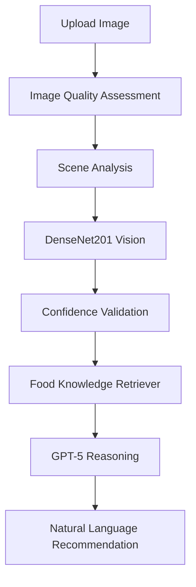

# 🍎 FreshSense AI

> **An Agentic AI system for fruit freshness assessment using Computer
> Vision, GPT-5, and Retrieval-Augmented Generation (RAG).**


------------------------------------------------------------------------

# 🚀 Overview

FreshSense AI is a production-style AI agent that combines **Computer
Vision, GPT‑5, and Retrieval-Augmented Generation (RAG)** to analyze
fruit freshness and generate grounded storage, shelf-life, and food
safety recommendations.

Unlike a traditional image classification demo, FreshSense demonstrates
a complete AI workflow:

-   🧠 DenseNet201 computer vision
-   🤖 GPT‑5 reasoning
-   📚 Retrieval-Augmented Generation (RAG)
-   🛠 Modular tool-based AI agent
-   📈 Confidence validation
-   🧪 Automated testing with GitHub Actions
-   🔄 Rule-based fallback for reliability

------------------------------------------------------------------------

# 🏗 System Architecture



------------------------------------------------------------------------

# ✨ Features

  Feature             Description
  ------------------- ------------------------------------------------
  🧠 DenseNet201      Fruit freshness classification
  📷 Image Quality    Blur, brightness and exposure detection
  🎯 Confidence       Confidence validation
  🤖 GPT‑5            Natural-language reasoning
  📚 Semantic RAG     Local embedding-based knowledge retrieval
  🔍 Explainable AI   Grounded explanations with retrieved knowledge
  🖼 Sample Images     Built-in testing images
  🧪 Testing          PyTest + GitHub Actions

------------------------------------------------------------------------

# ⚙️ AI Pipeline

1.  Upload a fruit image.
2.  Analyze image quality.
3.  Perform scene analysis.
4.  Predict freshness using DenseNet201.
5.  Validate confidence.
6.  Retrieve relevant food knowledge.
7.  Generate GPT‑5 reasoning.
8.  Produce storage and shelf-life recommendations.

------------------------------------------------------------------------

# 📸 Sample Images

The repository includes ready-to-use testing images.

``` text
sample_images/
├── apples/
├── bananas/
└── oranges/
```

Run the application:

``` bash
streamlit run app.py
```

Then upload any image from the **sample_images** folder to experience
the complete AI workflow immediately.

------------------------------------------------------------------------

# 💡 Example Output

**Prediction**

``` text
Fresh Banana
Confidence: 100%
```

**Retrieved Knowledge**

``` text
banana_storage
banana_overripe
banana_freezing
```

**GPT-5 Reasoning**

``` text
The banana appears fresh with no visible spoilage.
Store at room temperature until ripe, then refrigerate.
```

**Recommendation**

``` text
Shelf Life:
1–3 days at room temperature.

Storage:
Refrigerate after ripening.
```

------------------------------------------------------------------------

# 📁 Project Structure

``` text
FreshSense-AI/
├── api/
├── agent/
├── tools/
├── utils/
├── tests/
├── sample_images/
├── data/
├── docs/
├── models/
├── app.py
├── requirements.txt
└── README.md
```

------------------------------------------------------------------------

# ▶️ Quick Start

``` bash
python -m venv .venv
source .venv/Scripts/activate
pip install -r requirements.txt
python scripts/prepare_embedding_model.py
streamlit run app.py
```

The preparation command downloads the pinned local text-embedding model once.
After that, semantic retrieval runs on-device and does not require an internet
connection.

## Windows desktop application

FreshSense also includes a native Windows interface designed for people who do
not use Python or a terminal. Developers can run it with:

``` powershell
python desktop_app.py
```

Create the self-contained Windows distribution with:

``` powershell
pip install -r requirements-build.txt
powershell -ExecutionPolicy Bypass -File scripts/build_windows.ps1
```

The distributable application is written to
`dist/FreshSenseAI/FreshSenseAI.exe`. Ship the entire `FreshSenseAI` directory;
end users do not install Python, TensorFlow, or a virtual environment.

## Versioned REST API

FreshSense includes a FastAPI service for web, mobile, automation, and future
cloud clients. It reuses the same validated agent as the desktop application and
loads the vision model and semantic retriever exactly once during each API
process's startup lifespan.

Install the production dependencies, prepare the local embedding model, and run
one local API worker:

``` powershell
pip install -r requirements.txt
python scripts/prepare_embedding_model.py
python -m uvicorn api.main:app --host 127.0.0.1 --port 8000 --workers 1
```

Interactive OpenAPI documentation is available at `http://127.0.0.1:8000/docs`.
The versioned endpoints are:

- `GET /api/v1/health`: reports vision-model and semantic-retrieval readiness;
- `POST /api/v1/analyze`: accepts one JPEG, PNG, or WebP image as multipart field
  `file` and returns the prediction, confidence, image and scene assessments,
  retrieved passages and scores, warnings, reasoning, and recommendation.

Example requests:

``` powershell
curl.exe http://127.0.0.1:8000/api/v1/health
curl.exe -F "file=@C:\path\to\banana.png;type=image/png" `
  http://127.0.0.1:8000/api/v1/analyze
```

Replace the example path with an existing image. The API defaults to a 10 MiB
encoded-file limit and a 25-million-pixel decoded-image limit. Configure these
with `FRESHSENSE_API_MAX_UPLOAD_BYTES` and
`FRESHSENSE_API_MAX_IMAGE_PIXELS`.

The API accepts only declared JPEG, PNG, and WebP media types and verifies that
the decoded format matches the declaration. It serializes inference through a
shared lock because the agent and its model are shared across requests. Run a
single worker per model instance; scale with separate service replicas when
needed.

FreshSense never creates an application copy of the uploaded photo or retains
its filename. The multipart implementation may use short-lived operating-system
temporary storage while parsing an upload; the API explicitly closes that upload
before inference, allowing the temporary resource to be removed immediately.
The decoded image is also closed after the response is serialized.

### Private local scan history

The Windows desktop application keeps an optional recent-scan history on the
user's computer. Use **View scan history** to review results, export them to
CSV, or clear them after confirmation.

FreshSense stores only:

- scan date and time;
- the image's base file name, never its full path;
- the displayed result, confidence when accepted, risk, decision, and status.

Photos are not copied or retained. Uncertain results do not store the tentative
class or confidence. History is limited to the 200 newest records and is stored
under `%LOCALAPPDATA%\FreshSense\scan_history.json` on Windows. Developers and
managed installations can override this location with `FRESHSENSE_HISTORY_PATH`.

The history file remains local unless the user explicitly chooses **Export
CSV**. FreshSense does not upload scan history to GitHub, OpenAI, or a cloud
service.

FreshSense now fails closed when the configured model is missing or invalid.
Before starting the app, provide a trained Keras model at
`models/densenet201.h5`, or configure an absolute path:

``` bash
export FRESHSENSE_MODEL_PATH=/absolute/path/to/densenet201.h5
```

The knowledge base defaults to `data/food_knowledge_base.json` and can be
overridden with `FRESHSENSE_KNOWLEDGE_BASE_PATH`. Both assets are validated at
startup. The application will not generate a placeholder prediction when the
model cannot be loaded.

## Local semantic RAG

FreshSense ranks the reviewed knowledge-base entries with dense text
embeddings from `BAAI/bge-small-en-v1.5`. FastEmbed runs the model locally with
ONNX Runtime, and cosine similarity selects the three passages that best match
the predicted fruit, freshness state, storage, shelf-life, spoilage, and safety
query.

Retrieval is deliberately scoped before ranking: a supported prediction can
retrieve documents for that fruit plus general safety guidance, while an
uncertain result can retrieve only general guidance. Each retrieved document
records its retrieval method and similarity score, and the desktop details view
shows whether semantic retrieval was used.

Prepare the local embedding assets during development with:

``` powershell
python scripts/prepare_embedding_model.py
```

The Windows build script runs this step automatically and bundles the embedding
model in the application distribution. The app never sends photos, queries, or
knowledge-base text to an embedding service. If the local embedding model is
missing or cannot load, FreshSense continues with its deterministic keyword
retriever and displays a fallback warning instead of silently changing modes.

Semantic retrieval can be configured with:

- `FRESHSENSE_SEMANTIC_RAG`: set to `false` to disable embeddings;
- `FRESHSENSE_EMBEDDING_MODEL`: FastEmbed model identifier;
- `FRESHSENSE_EMBEDDING_CACHE_DIR`: local model-cache directory; and
- `FRESHSENSE_EMBEDDING_LOCAL_ONLY`: keep `true` in distributed builds to
  prevent runtime downloads.

This milestone uses in-memory cosine ranking because the curated knowledge base
is small. A persistent vector database is a separate roadmap item and is not
required for fully functioning semantic retrieval at the current scale.

## Configuration-driven fruit support

Supported fruits and model output labels are defined in
`data/fruit_catalog.json`. The catalog is the single source of truth for:

- the exact model-output class order;
- each class's fruit and fresh/rotten state;
- user-facing fruit names;
- fresh shelf-life estimates; and
- fresh storage guidance.

The catalog can be overridden with `FRESHSENSE_FRUIT_CATALOG_PATH`. FreshSense
validates it at startup and fails closed when labels are duplicated, a fruit is
missing either its fresh or rotten class, a class references an unknown fruit,
or the knowledge base has no entry for a configured fruit.

To add a fruit:

1. Train or fine-tune a model containing fresh and rotten outputs for the new
   fruit.
2. Add those labels to the catalog's `classes` list in the exact order returned
   by the model.
3. Add the fruit's display name, shelf life, and storage guidance to `fruits`.
4. Add at least one reviewed entry for the fruit to
   `data/food_knowledge_base.json`.
5. Run `pytest` and rebuild the desktop application.

No inference, retrieval, reasoning, recommendation, or desktop presentation
code needs to be rewritten for the new fruit. A newly trained model is still
required because configuration cannot add visual recognition by itself.

## Unsupported and uncertain photos

FreshSense exposes a dedicated **Unsupported or uncertain photo** result when
the prediction does not pass either of these application-level gates:

- minimum model confidence (`MIN_CONFIDENCE`); or
- minimum separation between the two most likely classes
  (`MIN_PREDICTION_MARGIN`).

For these results, FreshSense withholds the tentative class and does not
generate fruit-specific shelf-life or storage guidance. The desktop and
Streamlit interfaces also state that the current model supports one apple,
banana, or orange fruit type per photo.

These gates reduce ambiguous results but are not a general non-fruit detector.
A photograph outside the training distribution can still receive a high
softmax score. Production-grade out-of-distribution rejection requires a
reviewed negative-image test set and either a dedicated detector or a model
trained with explicit unsupported examples.

## Enable GPT‑5

``` bash
export OPENAI_API_KEY=YOUR_API_KEY
```

If no API key is configured, the application automatically falls back to
the built-in rule-based reasoning engine.

> **Safety notice:** FreshSense provides visual decision support only. It
> cannot establish that food is safe to consume or detect internal spoilage,
> contamination, odor, or texture. When in doubt, do not consume the fruit.

------------------------------------------------------------------------

# 🧪 Testing

``` bash
pytest
```

Every push automatically runs the test suite through GitHub Actions.

------------------------------------------------------------------------

# 🛠 Technology Stack

-   Python 3.11
-   TensorFlow / Keras
-   DenseNet201
-   Streamlit
-   OpenAI GPT‑5
-   Retrieval-Augmented Generation (RAG)
-   FastEmbed / ONNX Runtime
-   BAAI bge-small-en-v1.5 embeddings
-   FastAPI / Uvicorn
-   PyTest
-   GitHub Actions
-   Pillow
-   NumPy

------------------------------------------------------------------------

# 🗺 Roadmap

-   ✅ Computer Vision
-   ✅ Tool-based AI Agent
-   ✅ GPT‑5 Reasoning
-   ✅ Local RAG
-   ✅ Embedding-based Semantic RAG
-   ⏳ Vector Database
-   ✅ Local scan memory
-   ⏳ Multi-turn conversation memory
-   ✅ REST API
-   ⏳ Cloud Deployment

------------------------------------------------------------------------

# 👨‍💻 Author

**Yeqiao Yu**

------------------------------------------------------------------------

⭐ If you found this project interesting, please consider giving it a
star!
