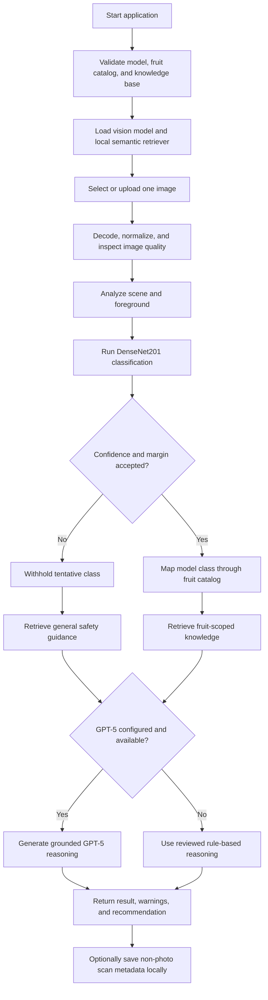

# FreshSense AI

FreshSense AI is a Windows-first fruit freshness decision-support application.
It combines a trained image classifier, confidence and image-quality checks,
local retrieval-augmented generation (RAG), and optional GPT-5 reasoning to
produce a freshness result with grounded storage and safety guidance.

> **Safety notice:** FreshSense evaluates visible image patterns only. It cannot
> determine whether food is safe to eat or detect internal spoilage,
> contamination, odor, or texture. When in doubt, do not consume the fruit.


## What FreshSense does

FreshSense accepts a photo containing one supported fruit type and returns:

- a fresh or rotten classification for apple, banana, or orange;
- model confidence when the result passes the safety gates;
- image-quality and scene warnings;
- retrieved storage, shelf-life, spoilage, and food-safety knowledge;
- an explanation, risk level, storage advice, and recommendation; and
- an explicit unsupported or uncertain result when confidence is insufficient.

The trained Keras model is the source of the visual prediction. FreshSense does
not generate a placeholder or random prediction if that model is missing or
invalid. Startup validation fails closed instead.

The application is available through three interfaces:

| Interface | Intended use | Entry point |
| --- | --- | --- |
| Windows desktop | Normal end-user scanning with local history | `desktop_app.py` |
| Streamlit web UI | Local development and demonstrations | `app.py` |
| Versioned REST API | Automation and future client integrations | `api.main:app` |

The desktop application runs without Docker and does not require the REST API.
A packaged Windows installer can include Python, the vision model, the knowledge
base, and local embedding assets so end users do not need a development
environment.

## Design flow

FreshSense loads and validates its shared assets once at startup. Each image then
moves through the same agent pipeline regardless of whether it came from the
desktop UI, Streamlit, or the REST API.



### Key design decisions

- **One shared agent:** all interfaces reuse the same vision, retrieval,
  reasoning, and recommendation components.
- **Configuration-driven labels:** `data/fruit_catalog.json` defines the exact
  model output order and fruit metadata.
- **Fail-closed startup:** the app refuses to start with an invalid model,
  catalog, or knowledge base.
- **Uncertainty gating:** low confidence or a small top-two class margin produces
  an uncertain result without fruit-specific advice.
- **Grounded reasoning:** retrieved knowledge is supplied to GPT-5 when enabled;
  a deterministic reviewed rules engine remains available as fallback.
- **Local-first retrieval:** embeddings and ranking run on-device. A keyword
  retriever is used with a visible warning if semantic embeddings are
  unavailable.
- **No required cloud backend:** only optional GPT-5 reasoning sends a text
  payload to the OpenAI API. The image itself is not sent to OpenAI by this
  application.

## Implemented features

| Feature | Status | Current behavior |
| --- | --- | --- |
| DenseNet201 computer vision | Implemented | Classifies fresh/rotten apple, banana, and orange labels from the configured model |
| Image-quality checks | Implemented | Detects dark, overexposed, and blurry images |
| Scene analysis | Implemented | Flags empty-looking scenes, small foregrounds, and photos needing a closer crop |
| Confidence safety gates | Implemented | Requires minimum confidence and class-margin thresholds |
| Unsupported/uncertain result | Implemented | Withholds the tentative class and fruit-specific guidance |
| Configuration-driven fruit catalog | Implemented | Validates class order, fruit metadata, and knowledge coverage at startup |
| Local RAG | Implemented | Retrieves curated food knowledge without an external service |
| Embedding-based semantic RAG | Implemented | Uses FastEmbed with `BAAI/bge-small-en-v1.5` and in-memory cosine ranking |
| Keyword retrieval fallback | Implemented | Preserves deterministic retrieval when embeddings cannot load |
| GPT-5 reasoning | Implemented, optional | Uses retrieved evidence when an API key is configured |
| Rule-based reasoning | Implemented | Provides reviewed offline guidance and GPT failure fallback |
| Windows desktop UI | Implemented | Photo selection, analysis, results, warnings, and history controls |
| Streamlit UI | Implemented | Browser-based local demonstration interface |
| Local scan history | Implemented | Stores up to 200 metadata-only records and supports CSV export and clearing |
| REST API | Implemented | Health, analysis, metrics, OpenAPI documentation, validation, and structured errors |
| API hardening | Implemented | Optional API key, rate limiting, trusted hosts, CORS controls, security headers, request IDs, and JSON logs |
| Windows installer pipeline | Implemented | Builds versioned installer, checksum, manifest, and install/uninstall smoke tests |
| Automated tests | Implemented | Pytest suite runs locally and through GitHub Actions |

### Not implemented yet

- persistent vector database;
- multi-turn conversation memory;
- hosted cloud deployment;
- a production out-of-distribution detector for arbitrary non-fruit photos; and
- trusted Authenticode signing by default (the release scripts support it, but a
  certificate must be configured).

The current semantic RAG is fully functional without a vector database because
the curated knowledge base is small enough for in-memory ranking.

## Supported inputs and limitations

The configured catalog contains six model output classes:

```text
freshapples
freshbanana
freshoranges
rottenapples
rottenbanana
rottenoranges
```

Use a clear JPEG, PNG, or WebP image containing one apple, banana, or orange
fruit type. Mixed-fruit scenes, processed food, severe occlusion, and images far
outside the training distribution are not reliable inputs.

Confidence thresholds reduce ambiguous results, but softmax confidence is not a
general non-fruit detector. Model accuracy should be reported only with the
dataset split, class balance, and evaluation method used to measure it.

## Run locally

### Requirements

- Windows 10 or 11 for the desktop and installer workflows;
- Python 3.11 for source development;
- a trained Keras model at `models/densenet201.h5`, or an absolute path in
  `FRESHSENSE_MODEL_PATH`; and
- the reviewed catalog and knowledge base in `data/`.

The trained model, datasets, secrets, and generated installers are intentionally
not committed to Git.

### Install development dependencies

```powershell
py -3.11 -m venv .venv
.\.venv\Scripts\Activate.ps1
python -m pip install --upgrade pip
python -m pip install -r requirements.txt
python scripts\prepare_embedding_model.py
```

The embedding preparation step downloads the pinned local embedding model once.
After preparation, semantic retrieval can run offline.

### Windows desktop

```powershell
python desktop_app.py
```

The packaged installer is the intended distribution for non-technical users.
They do not need Python, a virtual environment, TensorFlow, or Docker.

### Streamlit interface

```powershell
streamlit run app.py
```

### REST API

```powershell
python -m uvicorn api.main:app --host 127.0.0.1 --port 8000 --workers 1
```

OpenAPI documentation is available at
[http://127.0.0.1:8000/docs](http://127.0.0.1:8000/docs).

| Method | Endpoint | Purpose |
| --- | --- | --- |
| `GET` | `/api/v1/health` | Reports model, retrieval, authentication, and supported-fruit readiness |
| `POST` | `/api/v1/analyze` | Analyzes one multipart image in field `file` |
| `GET` | `/api/v1/metrics` | Returns process-local request and analysis metrics |

Example:

```powershell
curl.exe http://127.0.0.1:8000/api/v1/health
curl.exe -F "file=@C:\path\to\banana.png;type=image/png" `
  http://127.0.0.1:8000/api/v1/analyze
```

Keep the API bound to `127.0.0.1` for local development. Before exposing it to
another client, configure API-key authentication, explicit trusted hosts, and
specific CORS origins. See [Windows release documentation](docs/WINDOWS_RELEASE.md)
for the supported operational workflow.

## Privacy and storage

- Desktop and Streamlit analysis read the selected local photo but do not create
  an application copy.
- The REST API closes uploaded temporary resources before inference and does not
  retain the uploaded filename or image in application storage.
- Desktop history stores only the scan timestamp, base filename, displayed
  result, accepted confidence, risk, decision, and status.
- Desktop history is limited to 200 records and defaults to
  `%LOCALAPPDATA%\FreshSense\scan_history.json`.
- Photos and history are not uploaded to GitHub or a FreshSense cloud service.
- When GPT-5 reasoning is enabled, the application sends prediction metadata,
  quality/scene data, warnings, and retrieved text to OpenAI; it does not include
  the photo.

## Configuration

Common environment variables:

| Variable | Purpose |
| --- | --- |
| `FRESHSENSE_MODEL_PATH` | Absolute path to the trained Keras model |
| `FRESHSENSE_FRUIT_CATALOG_PATH` | Override the model-label and fruit catalog |
| `FRESHSENSE_KNOWLEDGE_BASE_PATH` | Override the curated food knowledge base |
| `FRESHSENSE_SEMANTIC_RAG` | Enable or disable local semantic retrieval |
| `FRESHSENSE_EMBEDDING_CACHE_DIR` | Local embedding-model cache |
| `OPENAI_API_KEY` | Enable optional GPT-5 reasoning |
| `OPENAI_MODEL` | Override the configured OpenAI model |
| `USE_LLM_REASONING` | Enable or disable LLM reasoning |
| `FRESHSENSE_HISTORY_PATH` | Override desktop history storage |
| `FRESHSENSE_REQUIRE_API_KEY` | Require an API key for analysis and metrics |
| `FRESHSENSE_API_KEY_FILE` | Read the API key from a local secret file |
| `FRESHSENSE_ALLOWED_HOSTS` | Comma-separated trusted API hosts |
| `FRESHSENSE_CORS_ORIGINS` | Comma-separated allowed browser origins |

API upload size, decoded pixel limits, rate limits, JSON logging, and
semantic-readiness requirements are also configurable in `utils/config.py`.

## Project structure

```text
FreshSense-AI/
|-- agent/                 Agent orchestration and state
|-- api/                   FastAPI application, schemas, security, and metrics
|-- data/                  Fruit catalog and curated knowledge base
|-- desktop/               Local history and desktop presentation helpers
|-- docs/                  Development logs and release documentation
|-- installer/             Inno Setup definition
|-- scripts/               Embedding, build, verification, signing, and smoke tools
|-- tests/                 Unit, API, retrieval, safety, history, and release tests
|-- tools/                 Vision, quality, scene, retrieval, and reasoning tools
|-- utils/                 Configuration, startup validation, catalog, and versioning
|-- app.py                 Streamlit entry point
|-- desktop_app.py         Windows desktop entry point
|-- FreshSenseAI.spec      PyInstaller build definition
|-- requirements.txt       Pinned complete development/runtime dependencies
`-- VERSION                Application release version
```

## Test and build

Run the complete test suite:

```powershell
python -m pytest
```

Build the Windows release:

```powershell
python -m pip install -r requirements-build.txt
powershell -ExecutionPolicy Bypass -File scripts\build_windows.ps1
```

The release pipeline runs tests, validates bundled assets, builds the application
and per-user installer, and writes the following files to the workspace-level
`outputs` directory:

- `FreshSenseAI-Setup-<version>.exe`;
- `FreshSenseAI-Setup-<version>.exe.sha256`; and
- `FreshSenseAI-Release-<version>.json`.

See [docs/WINDOWS_RELEASE.md](docs/WINDOWS_RELEASE.md) for clean-machine testing,
checksum verification, optional code signing, and GitHub Release instructions.

## Extending fruit support

Fruit support is configuration-driven, but a newly trained model is still
required for new visual classes.

1. Train or fine-tune a model with fresh and rotten outputs for the new fruit.
2. Add the new labels to `data/fruit_catalog.json` in exact model-output order.
3. Add the fruit's display name, shelf life, and storage guidance.
4. Add reviewed knowledge entries to `data/food_knowledge_base.json`.
5. Run the full test suite and rebuild the desktop application.

Inference, retrieval, reasoning, API, and presentation code do not need
fruit-specific rewrites when the catalog and model remain consistent.

## Documentation

- [Windows release guide](docs/WINDOWS_RELEASE.md)
- [Windows release development log](docs/DEVELOPMENT_LOG_WINDOWS_RELEASE.md)
- [REST API development log](docs/DEVELOPMENT_LOG_REST_API.md)
- [Semantic RAG development log](docs/DEVELOPMENT_LOG_SEMANTIC_RAG.md)
- [Local history development log](docs/DEVELOPMENT_LOG_LOCAL_HISTORY.md)
- [Configuration update log](docs/DEVELOPMENT_LOG_CONFIGURATION_UPDATE.md)

## Author

Yeqiao Yu
