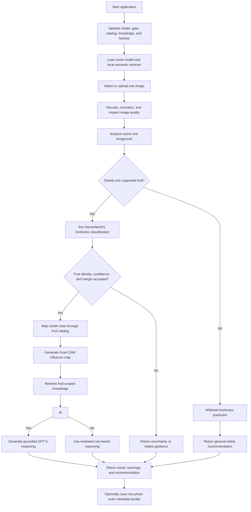

# FreshSense AI

FreshSense is a Windows-first AI decision-support application that explains
visible freshness patterns in apples, bananas, and oranges. It combines a
DenseNet201 image classifier, supported-input and confidence gates, Grad-CAM,
local semantic RAG, optional GPT-5 reasoning, and reviewed fallback guidance.

[](https://github.com/yyq8548/FreshSenseAI--app/releases/download/v0.5.1/FreshSenseAI-Setup-0.5.1.exe)


[Watch the 30-second beta walkthrough](docs/demo/freshsense-public-beta-demo.mp4)

## Try it in three steps

1. Download `FreshSenseAI-Setup-0.5.1.exe` from the latest GitHub Release and
   compare its SHA-256 with the published checksum.
2. Install and choose one clear photo containing an apple, banana, or orange.
3. Select **Analyze freshness**, then review the result, risk guidance, storage
   advice, safety warning, and optional model-influence view.

No Python, virtual environment, Docker, model download, or API setup is required
for the packaged Windows beta.

> **Safety notice:** FreshSense evaluates visible image patterns only. It cannot
> determine whether food is safe to eat or detect internal spoilage,
> contamination, odor, texture, pathogens, or chemical hazards. When in doubt,
> do not consume the fruit.

## Supported input

- One clear apple, banana, or orange fruit type per image.
- JPEG, PNG, or WebP for the Streamlit interface; JPEG or PNG for desktop.
- Close framing, useful lighting, and limited occlusion.

Mixed fruit, other produce, packaged food, people, drawings, empty scenes, and
severely degraded photos are outside the intended input contract. FreshSense
can return unsupported, uncertain, or retake guidance instead of exposing a
tentative freshness label.

## Privacy by default

- Desktop and Streamlit analysis do not create an application copy of a photo.
- Photos are not automatically uploaded to GitHub or a FreshSense server.
- Local scan history contains metadata only and can be exported or cleared.
- Optional GPT-5 reasoning sends prediction and retrieved text, not the photo.
- The feedback action opens a prefilled GitHub issue without attaching the
  analyzed photo. Testers decide whether to add a de-identified image.

## Current evidence limits

The model's six-class confidence is not general certainty. The legacy dataset
contains source-group leakage, so earlier 97 to 99 percent test results are not
independent real-world accuracy. The frozen synthetic unsupported
false-acceptance rate is 5.73 percent and does not replace testing with real
unsupported photos. Earlier informal testing reportedly involved more than 50
users and three orange errors, but case-level counts and post-change retesting
are not complete. See the [model card](docs/MODEL_CARD.md) and
[public-beta pilot plan](docs/PUBLIC_BETA_PILOT.md).

## What FreshSense does

FreshSense accepts a photo containing one supported fruit type and returns:

- a fresh or rotten classification for apple, banana, or orange;
- model confidence when the result passes the safety gates;
- an optional Grad-CAM influence overlay for accepted predictions;
- image-quality and scene warnings;
- retrieved storage, shelf-life, spoilage, and food-safety knowledge;
- an explanation, risk level, storage advice, and recommendation; and
- an explicit unsupported or uncertain result when the supported-fruit gate,
  fruit-identity agreement, confidence, or class margin is insufficient.

The trained Keras model is the source of the visual prediction. FreshSense does
not generate a placeholder or random prediction if that model is missing or
invalid. Startup validation fails closed instead.

The application is available through three interfaces:

| Interface | Intended use | Entry point |
| --- | --- | --- |
| Windows desktop | Normal end-user scanning with local history | `desktop_app.py` |
| Streamlit web UI | Local development and demonstrations | `app.py` |
| Versioned REST API | Automation and future client integrations | `api.main:app` |

The desktop application runs without Docker and does not require the REST API.
A packaged Windows installer can include Python, the vision model, the knowledge
base, and local embedding assets so end users do not need a development
environment.

## Design flow

FreshSense loads and validates its shared assets once at startup. Each image then
moves through the same agent pipeline regardless of whether it came from the
desktop UI, Streamlit, or the REST API.



### Key design decisions

- **One shared agent:** all interfaces reuse the same vision, retrieval,
  reasoning, and recommendation components.
- **Configuration-driven labels:** `data/fruit_catalog.json` defines the exact
  model output order and fruit metadata.
- **Fail-closed startup:** the app refuses to start with an invalid model,
  calibrated gate, catalog, knowledge base, or model/gate hash mismatch.
- **Dedicated supported-input gate:** DenseNet feature prototypes first decide
  whether an image clearly resembles one supported fruit identity; freshness
  classification is exposed only after that decision passes.
- **Uncertainty gating:** low confidence or a small top-two class margin produces
  an uncertain result without fruit-specific advice.
- **Grounded reasoning:** retrieved knowledge is supplied to GPT-5 when enabled;
  a deterministic reviewed rules engine remains available as fallback.
- **Local-first retrieval:** embeddings and ranking run on-device. A keyword
  retriever is used with a visible warning if semantic embeddings are
  unavailable.
- **Bounded explainability:** Grad-CAM is generated only for accepted model
  classes and is presented as influence, never proof of spoilage.
- **No required cloud backend:** only optional GPT-5 reasoning sends a text
  payload to the OpenAI API. The image itself is not sent to OpenAI by this
  application.

## Implemented features

| Feature | Status | Current behavior |
| --- | --- | --- |
| DenseNet201 computer vision | Implemented | Classifies fresh/rotten apple, banana, and orange labels from the configured model |
| Image-quality checks | Implemented | Detects dark, overexposed, and blurry images |
| Scene analysis | Implemented | Flags empty-looking scenes, small foregrounds, and photos needing a closer crop |
| Confidence safety gates | Implemented | Requires minimum confidence and class-margin thresholds |
| Supported-input/open-set gate | Implemented baseline | Uses calibrated feature prototypes, model hashes, and fruit agreement before freshness output |
| Grad-CAM explainability | Implemented | Shows an in-memory influence overlay for accepted desktop results; API overlay bytes are opt-in |
| Unsupported/uncertain result | Implemented | Withholds the tentative class and fruit-specific guidance |
| Configuration-driven fruit catalog | Implemented | Validates class order, fruit metadata, and knowledge coverage at startup |
| Local RAG | Implemented | Retrieves curated food knowledge without an external service |
| Embedding-based semantic RAG | Implemented | Uses FastEmbed with `BAAI/bge-small-en-v1.5` and in-memory cosine ranking |
| Keyword retrieval fallback | Implemented | Preserves deterministic retrieval when embeddings cannot load |
| GPT-5 reasoning | Implemented, optional | Uses retrieved evidence when an API key is configured |
| Rule-based reasoning | Implemented | Provides reviewed offline guidance and GPT failure fallback |
| Windows desktop UI | Implemented | Photo selection, analysis, results, warnings, and history controls |
| Streamlit UI | Implemented | Responsive scanner, bundled samples, evidence hierarchy, safety states, and progressive technical disclosure |
| Local scan history | Implemented | Stores up to 200 metadata-only records and supports CSV export and clearing |
| REST API | Implemented | Health, analysis, metrics, OpenAPI documentation, validation, and structured errors |
| API hardening | Implemented | Optional API key, rate limiting, trusted hosts, CORS controls, security headers, request IDs, and JSON logs |
| Windows installer pipeline | Implemented | Builds versioned installer, checksum, manifest, and install/uninstall smoke tests |
| Automated tests | Implemented | Pytest suite runs locally and through GitHub Actions |
| Reproducible ML evaluation | Implemented | Versioned grouped manifests, safety metrics, plots, calibration, subgroup and latency reports |
| Real-model Windows CI | Implemented | Immutable checksum bundle, golden predictions, OOD regression, semantic RAG, secure API, installer build/launch |
| Controlled pilot tooling | Implemented | SQLite-backed metadata-only outcome, usability, comprehension, timing, and CSV reporting |
| MLflow model experiments | Implemented | Tracks grouped MobileNetV2 parameters, metrics, latency, reports, and model artifacts in local SQLite |
| Stakeholder and handoff package | Implemented | Defines workflow, value hypothesis, success criteria, risks, ownership, and production gaps |
| Fictional insurance RAG companion | Implemented example | Citation-first semantic retrieval, abstention, typed API, human oversight, and evaluation over authored fictional data |
| Azure readiness gate | Implemented, blocked by evidence | Fails closed until independent evaluation, pilot, tests, security review, and owner approvals exist |

### Not implemented yet

- persistent vector database;
- multi-turn conversation memory;
- hosted cloud deployment (the Azure gate currently blocks it);
- an independently validated arbitrary-object detector and real-world benchmark;
- completed human-reviewed pilot observations; and
- trusted Authenticode signing by default (the release scripts support it, but a
  certificate must be configured).

The current semantic RAG is fully functional without a vector database because
the curated knowledge base is small enough for in-memory ranking.

## Supported inputs and limitations

The configured catalog contains six model output classes:

```text
freshapples
freshbanana
freshoranges
rottenapples
rottenbanana
rottenoranges
```

Use a clear JPEG, PNG, or WebP image containing one apple, banana, or orange
fruit type. Mixed-fruit scenes, processed food, severe occlusion, and images far
outside the training distribution are not reliable inputs.

Softmax confidence covers only the six configured categories and is not treated
as general certainty. FreshSense 0.5 retains a separate feature-space gate, but the
frozen synthetic unsupported false-acceptance rate is still 5.73%. The legacy
dataset audit also found 100% source-group overlap from legacy test into train,
so earlier 97-99% results are not independent real-world accuracy. See the
[model card](docs/MODEL_CARD.md) for the complete evidence and limitations.

## Run locally

### Requirements

- Windows 10 or 11 for the desktop and installer workflows;
- Python 3.11 for source development;
- a trained Keras model at `models/densenet201.h5`, or an absolute path in
  `FRESHSENSE_MODEL_PATH`; and
- its calibrated gate at `models/open_set_gate.npz`; and
- the reviewed catalog and knowledge base in `data/`.

The trained model, datasets, secrets, and generated installers are intentionally
not committed to Git.

### Install development dependencies

```powershell
py -3.11 -m venv .venv
.\.venv\Scripts\Activate.ps1
python -m pip install --upgrade pip
python -m pip install -r requirements.txt
python scripts\prepare_embedding_model.py
```

The embedding preparation step downloads the pinned local embedding model once.
After preparation, semantic retrieval can run offline.

### Windows desktop

```powershell
python desktop_app.py
```

The packaged installer is the intended distribution for non-technical users.
They do not need Python, a virtual environment, TensorFlow, or Docker.

### Streamlit interface

```powershell
streamlit run app.py
```

The redesigned Streamlit experience includes a real scanner workspace, bundled
apple, banana, and orange samples, explicit loading and withheld-result states,
retrieval evidence, Grad-CAM when available, technical diagnostics, the agent
trace, and a privacy-conscious incorrect-result link. Bundled samples demonstrate
the supported interaction only; they are not independent accuracy evidence.

### REST API

```powershell
python -m uvicorn api.main:app --host 127.0.0.1 --port 8000 --workers 1
```

OpenAPI documentation is available at
[http://127.0.0.1:8000/docs](http://127.0.0.1:8000/docs).

| Method | Endpoint | Purpose |
| --- | --- | --- |
| `GET` | `/api/v1/health` | Reports model, retrieval, authentication, and supported-fruit readiness |
| `POST` | `/api/v1/analyze` | Analyzes one multipart image in field `file` |
| `GET` | `/api/v1/metrics` | Returns process-local request and analysis metrics |

Example:

```powershell
curl.exe http://127.0.0.1:8000/api/v1/health
curl.exe -F "file=@C:\path\to\banana.png;type=image/png" `
  http://127.0.0.1:8000/api/v1/analyze
```

Keep the API bound to `127.0.0.1` for local development. Before exposing it to
another client, configure API-key authentication, explicit trusted hosts, and
specific CORS origins. See [Windows release documentation](docs/WINDOWS_RELEASE.md)
for the supported operational workflow.

## Privacy and storage

- Desktop and Streamlit analysis read the selected local photo but do not create
  an application copy.
- The REST API closes uploaded temporary resources before inference and does not
  retain the uploaded filename or image in application storage.
- Desktop history stores only the scan timestamp, base filename, displayed
  result, accepted confidence, risk, decision, and status.
- Desktop history is limited to 200 records and defaults to
  `%LOCALAPPDATA%\FreshSense\scan_history.json`.
- Photos and history are not uploaded to GitHub or a FreshSense cloud service.
- When GPT-5 reasoning is enabled, the application sends prediction metadata,
  quality/scene data, warnings, and retrieved text to OpenAI; it does not include
  the photo.

## Configuration

Common environment variables:

| Variable | Purpose |
| --- | --- |
| `FRESHSENSE_MODEL_PATH` | Absolute path to the trained Keras model |
| `FRESHSENSE_OPEN_SET_GATE_PATH` | Override the calibrated supported-input gate |
| `FRESHSENSE_REQUIRE_OPEN_SET_GATE` | Fail startup unless the model-bound gate validates |
| `FRESHSENSE_FRUIT_CATALOG_PATH` | Override the model-label and fruit catalog |
| `FRESHSENSE_KNOWLEDGE_BASE_PATH` | Override the curated food knowledge base |
| `FRESHSENSE_SEMANTIC_RAG` | Enable or disable local semantic retrieval |
| `FRESHSENSE_EMBEDDING_CACHE_DIR` | Local embedding-model cache |
| `OPENAI_API_KEY` | Enable optional GPT-5 reasoning |
| `OPENAI_MODEL` | Override the configured OpenAI model |
| `USE_LLM_REASONING` | Enable or disable LLM reasoning |
| `FRESHSENSE_HISTORY_PATH` | Override desktop history storage |
| `FRESHSENSE_REQUIRE_API_KEY` | Require an API key for analysis and metrics |
| `FRESHSENSE_API_KEY_FILE` | Read the API key from a local secret file |
| `FRESHSENSE_ALLOWED_HOSTS` | Comma-separated trusted API hosts |
| `FRESHSENSE_CORS_ORIGINS` | Comma-separated allowed browser origins |

API upload size, decoded pixel limits, rate limits, JSON logging, and
semantic-readiness requirements are also configurable in `utils/config.py`.

## Project structure

```text
FreshSense-AI/
|-- agent/                 Agent orchestration and state
|-- api/                   FastAPI application, schemas, security, and metrics
|-- artifacts/             Cryptographic runtime/evaluation association manifest
|-- data/                  Fruit catalog and curated knowledge base
|-- deployment/            Fail-closed Azure readiness checks and handoff assets
|-- desktop/               Local history and desktop presentation helpers
|-- docs/                  Development logs and release documentation
|-- evaluation/            Dataset manifests, calibration, metrics, plots, and reports
|-- examples/              Isolated fictional insurance-policy RAG companion
|-- installer/             Inno Setup definition
|-- pilot/                 SQLite metadata-only controlled-pilot records and summaries
|-- scripts/               Embedding, build, verification, signing, and smoke tools
|-- tests/                 Unit, API, retrieval, safety, history, and release tests
|-- training/              Grouped MobileNetV2 training and MLflow tracking
|-- tools/                 Vision, quality, scene, retrieval, and reasoning tools
|-- ui/                    Streamlit presentation components, styles, and sample discovery
|-- utils/                 Configuration, startup validation, catalog, and versioning
|-- app.py                 Streamlit entry point
|-- desktop_app.py         Windows desktop entry point
|-- FreshSenseAI.spec      PyInstaller build definition
|-- requirements.txt       Pinned production dependencies
|-- requirements-training.txt  Pinned MLflow experiment dependencies
`-- VERSION                Application release version
```

## Test and build

Run the complete test suite:

```powershell
python -m pytest
```

Verify the exact model, gate, dataset manifest, and report association:

```powershell
python scripts\verify_model_artifacts.py
```

Rebuild the grouped legacy report:

```powershell
python scripts\run_evaluation.py `
  --manifest evaluation\manifests\legacy_grouped_v1.json `
  --dataset C:\path\to\fruit_scanner\dataset
```

Build the Windows release:

```powershell
python -m pip install -r requirements-build.txt
powershell -ExecutionPolicy Bypass -File scripts\build_windows.ps1
```

The release pipeline runs tests, validates bundled assets, builds the application
and per-user installer, and writes the following files to the workspace-level
`outputs` directory:

- `FreshSenseAI-Setup-<version>.exe`;
- `FreshSenseAI-Setup-<version>.exe.sha256`; and
- `FreshSenseAI-Release-<version>.json`.

See [docs/WINDOWS_RELEASE.md](docs/WINDOWS_RELEASE.md) for clean-machine testing,
checksum verification, optional code signing, and GitHub Release instructions.

## Extending fruit support

Fruit support is configuration-driven, but a newly trained model is still
required for new visual classes.

1. Train or fine-tune a model with fresh and rotten outputs for the new fruit.
2. Add the new labels to `data/fruit_catalog.json` in exact model-output order.
3. Add the fruit's display name, shelf life, and storage guidance.
4. Add reviewed knowledge entries to `data/food_knowledge_base.json`.
5. Run the full test suite and rebuild the desktop application.

Inference, retrieval, reasoning, API, and presentation code do not need
fruit-specific rewrites when the catalog and model remain consistent.

## Documentation

- [Windows release guide](docs/WINDOWS_RELEASE.md)
- [FreshSense 0.5.1 Public Beta release notes](docs/releases/0.5.1.md)
- [Public Beta pilot and retest plan](docs/PUBLIC_BETA_PILOT.md)
- [Orange reliability plan](docs/ORANGE_RELIABILITY_PLAN.md)
- [DenseNet201 model card](docs/MODEL_CARD.md)
- [Real-world benchmark collection protocol](docs/BENCHMARK_COLLECTION.md)
- [Limited pilot guide](docs/PILOT_GUIDE.md)
- [Stakeholder case study](docs/STAKEHOLDER_CASE_STUDY.md)
- [Technology handoff](docs/TECHNOLOGY_HANDOFF.md)
- [Model experiments with MLflow](docs/MODEL_EXPERIMENTS.md)
- [Azure handoff and readiness gate](docs/AZURE_HANDOFF.md)
- [FreshSense 0.4 development log](docs/DEVELOPMENT_LOG_FRESHSENSE_0_4.md)
- [FreshSense 0.3 development log](docs/DEVELOPMENT_LOG_FRESHSENSE_0_3.md)
- [Windows release development log](docs/DEVELOPMENT_LOG_WINDOWS_RELEASE.md)
- [REST API development log](docs/DEVELOPMENT_LOG_REST_API.md)
- [Semantic RAG development log](docs/DEVELOPMENT_LOG_SEMANTIC_RAG.md)
- [Local history development log](docs/DEVELOPMENT_LOG_LOCAL_HISTORY.md)
- [Configuration update log](docs/DEVELOPMENT_LOG_CONFIGURATION_UPDATE.md)

## Author

Yeqiao Yu
