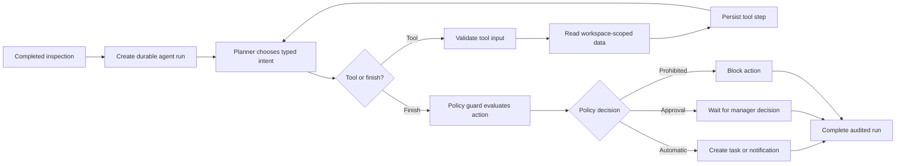

# FreshSense Autonomous Agent Architecture

## Status

The autonomous-agent workstream now supports both **shadow** and **supervised**
execution. Each hosted inspection triggers a bounded workflow that observes the
vision result, reads same-batch/store/fruit history, retrieves reviewed operating
knowledge, consults durable human-review memory, selects one follow-up, applies a
policy decision, and writes a complete audit trail.

This distinction is important. The existing `FruitScannerAgent` orchestrates a
fixed image-analysis pipeline. The new `AutonomousInspectionAgent` adds a durable
observe-plan-tool-finish loop. Its first planner remains deterministic. In
supervised mode it may create reversible in-product tasks and notifications;
high-risk actions wait for a manager, and prohibited actions remain blocked.

## Implemented runtime

The first tool set is intentionally read-only:

- `get_inspection_context` loads the selected inspection from the authenticated
  workspace;
- `list_recent_inspections` finds relevant recent inspections and human
  corrections in that same workspace;
- `retrieve_operating_knowledge` retrieves fruit guidance and fixed safety rules;
- `list_review_memory` reads durable human-review outcomes.

Every tool call uses a strict Pydantic input contract. Unknown tools, malformed
arguments, cross-workspace records, oversized JSON payloads, and runs above the
configured step bound fail closed.

## Policy boundary

Planning and authority are separate components. The policy guard currently
classifies proposals as follows:

| Proposed action | Policy | Current execution |
| --- | --- | --- |
| Complete with no action | Automatic | Audit completion |
| Request a clearer photo | Automatic | Creates an inspector task and notification |
| Create a human-review task | Automatic | Creates a reviewer task and notification |
| Notify a manager | Automatic | Creates a manager notification |
| Hold a batch | Manager approval required | Creates an approval request; approval creates a manager execution task |
| Discard inventory | Prohibited | Never executed |
| Declare food safe | Prohibited | Never executed |

Food-safety and inventory-disposal authority must never be delegated to the
image model or an LLM. Even an approved batch hold does not call an external
inventory system in the current implementation; it creates an explicit manager
task so the physical action stays visible and controlled.

## Persistence and API

Schema version 5 stores agent runs, steps, proposals, workflow tasks,
notifications, approval requests, human-review memory, Manager Chat text,
grounding citations, and per-manager preferences. Uploaded image bytes are not
added to agent or conversation storage.

The REST API exposes:

- `POST /api/v1/agent/runs` to run the bounded supervisor for one inspection;
- `GET /api/v1/agent/runs` to list audited runs in the current workspace;
- `GET /api/v1/agent/runs/{run_id}` to inspect tool steps and proposals;
- `GET /api/v1/workflow/tasks` for role-scoped work;
- `GET /api/v1/notifications` for in-product completion notices;
- `GET/PATCH /api/v1/approvals` for manager decisions;
- `GET /api/v1/agent/memory` for durable review outcomes;
- `GET /api/v1/reports/daily` for daily quality summaries.
- `/api/v1/manager/*` for manager-only, grounded multi-turn questions about the
  workspace audit trail.

Managers and inspectors can start runs. Managers, inspectors, and reviewers can
read the workspace audit trail. Existing Entra/API-key authentication and
workspace-role checks apply to these routes.

## What remains before operational autonomy

The following work is intentionally not represented as complete:

1. Replace or augment the deterministic planner with a structured-output LLM
   planner that can select only registered tools. Retain the deterministic
   planner as a tested fallback.
2. Add a durable job queue, leases, idempotency keys, retry limits, timeouts,
   cancellation, and restart recovery. A synchronous API request is not a
   production autonomous worker.
3. Connect external operational tools one at a time. Each tool needs an explicit
   permission, idempotency behavior, compensating action, audit record, and
   failure policy.
4. Evaluate supervised actions against human decisions. Measure action precision,
   false escalation, missed escalation, override rate, latency, and cost.
5. Add alerting, run dashboards, prompt/tool versioning, red-team tests, and an
   emergency kill switch before a controlled pilot.

## Promotion gates

Supervised execution must remain limited to internal reversible actions until a
versioned evaluation shows that the agent improves the inspection workflow
without unacceptable false holds or missed reviews:

1. **Shadow:** proposals are visible only in the audit trail.
2. **Supervised:** tasks and notifications execute; managers resolve approvals.
3. **Integrated:** approved actions can call a tested inventory connector.
4. **Limited automatic:** only measured, reversible low-risk actions execute
   automatically, with per-workspace opt-in and an immediate kill switch.

FreshSense should not advance to the next stage based only on functional tests.
Human-reviewed pilot evidence is the release criterion.
